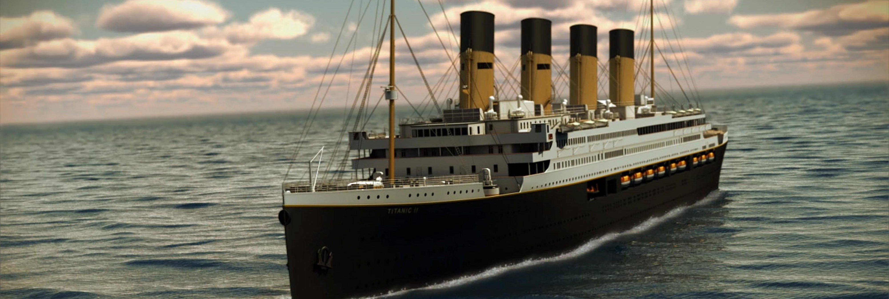

# Titanic
## Machine learning from disaster

This is the legendary [**Titanic ML kaggle competition**](https://www.kaggle.com/c/titanic)

### Goal
Create a model that predicts the **probability of survival of passengers** in a shipwreck.

### Model selection
Selection of classification algorithms:

1. Logistic Regression
2. Gaussian Naive Bayes
3. K-nearest Neighbors
4. Linear Support Vector Machine
5. Random Forest

### The Winner
**Random Forest** > Multiple Random Decision Trees

### Conclusions

Chances to survive:

**~80% accuracy** 
**~71% f1-score** 
**~82% ROC-AUC score**

The model is quite good in predicting the probability of survival of the passengers but there is still room for improvement.
